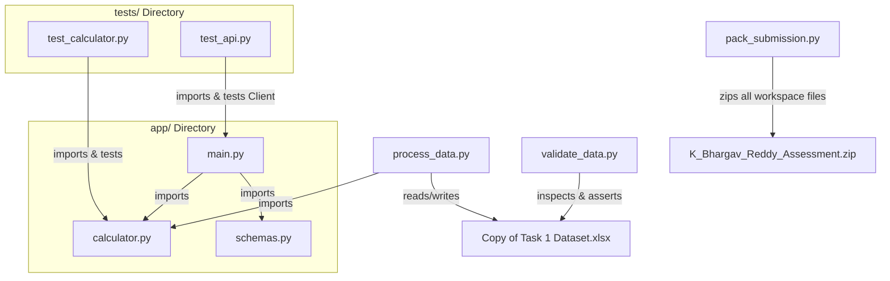

# Fruit Ninja Gameplay Performance Assessment

This repository contains the analysis, metric formulas, processing scripts, and a FastAPI endpoint designed to evaluate children's cognitive performance based on Fruit Ninja gameplay data.

---

## 📋 Table of Contents
1. [Theoretical Framework & Formulas](#-theoretical-framework--formulas)
2. [Data Analysis & Statistical Insights](#-data-analysis--statistical-insights)
3. [Repository Structure](#-repository-structure)
4. [Installation & Setup](#-installation--setup)
5. [How to Run Scripts](#-how-to-run-scripts)
6. [API Usage & Swagger Documentation](#-api-usage--swagger-documentation)
7. [AI Tools Used](#-ai-tools-used)

---

## 🧠 Theoretical Framework & Formulas

To translate raw gameplay metrics into cognitive performance indicators, we designed five normalized rates (scaled to $0-100$) and a holistic **Overall Performance Score**.

### 1. Accuracy Rate (0–100)
* **Goal**: Measures how accurately the player interacts with valid targets while avoiding mistakes.
* **Formula**:
  $$\text{Accuracy Rate} = 100 \times \frac{\text{fruits\_sliced}}{\text{fruits\_sliced} + \text{fruits\_missed} + \text{bombs\_hit}}$$
* **Cognitive Rationale**: This is modeled after the **Jaccard Index (Threat Score)**, which represents $\frac{\text{True Positives}}{\text{True Positives} + \text{False Negatives} + \text{False Positives}}$.
  * **True Positives (TP)**: Slicing valid targets (`fruits_sliced`).
  * **False Negatives (FN)**: Missing valid targets (`fruits_missed`).
  * **False Positives (FP)**: Slicing invalid targets (`bombs_hit`).
  * If a session has zero interactions, the score defaults to `0.0`.

### 2. Response Rate (0–100)
* **Goal**: Measures how quickly and effectively the player responds to gameplay events.
* **Formula**:
  * $\text{Action Speed} = \frac{\text{fruits\_sliced} + \text{bombs\_dodged}}{\text{session\_duration\_seconds}}$
  * $\text{Speed Score} = \min\left(100.0, 100.0 \times \frac{\text{Action Speed}}{2.5}\right)$
  * $\text{Combo Score} = \min\left(100.0, 100.0 \times \frac{\text{max\_combo}}{50.0}\right)$
  * $$\text{Response Rate} = 0.6 \times \text{Speed Score} + 0.4 \times \text{Combo Score}$$
* **Cognitive Rationale**: Combines **raw speed** (correct physical interactions per second) and **strategic response efficacy** (combos represent planning and high-speed precision). 
  * The dataset's empirical maximum speed is around $3.9$ actions/sec, with a median of $0.71$. A benchmark of $2.5$ actions/sec is set as the $100\%$ speed threshold, which filters out extreme outliers while rewarding fast play.
  * `max_combo` is scaled relative to the game's empirical limit of $50$.

### 3. Error Rate (0–100)
* **Goal**: Measures the frequency and severity of mistakes.
* **Formula**:
  $$\text{Error Rate} = \min\left(100.0, 100.0 \times \frac{\text{fruits\_missed} + 3.0 \times \text{bombs\_hit}}{\text{fruits\_sliced} + \text{fruits\_missed} + \text{bombs\_hit} + \text{bombs\_dodged}}\right)$$
* **Cognitive Rationale**: Slicing a bomb is a **critical failure** (leading to a lost life or instant game over) and is weighted $3\times$ heavier than simply letting a fruit drop (`fruits_missed`). 
  * The total error is divided by the sum of all spawning events to represent frequency relative to opportunities, then scaled to $100$ and clipped.

### 4. Persistence Rate (0–100)
* **Goal**: Measures the player's willingness to continue and stay engaged despite challenges.
* **Formula**:
  * $\text{Retries Score} = 100.0 \times \frac{\text{retries}}{3.0}$
  * $\text{Duration Score} = 100.0 \times \frac{\text{session\_duration\_seconds}}{300.0}$
  * $\text{Pause Penalty} = 20.0 \times \frac{\text{pause\_count}}{5.0}$
  * $$\text{Persistence Rate} = \max\left(0.0, \min\left(100.0, 0.5 \times \text{Retries Score} + 0.5 \times \text{Duration Score} - \text{Pause Penalty}\right)\right)$$
* **Cognitive Rationale**: Focus and grit are demonstrated by restarting the session (`retries`, max 3) and spending more time in-session (`duration`, max 300s). Frequent pausing breaks focus and task flow, and is penalized up to 20 points.

### 5. Consistency Rate (0–100)
* **Goal**: Measures how stable and reliable the player's performance remains.
* **Formula**:
  * $\text{Combo Consistency} = \min\left(100.0, 100.0 \times \frac{\text{max\_combo}}{\text{fruits\_sliced}}\right)$
  * $\text{Stability Score} = 100.0 - \text{Error Rate}$
  * $\text{Pause Penalty} = 20.0 \times \frac{\text{pause\_count}}{5.0}$
  * $$\text{Consistency Rate} = \max\left(0.0, \min\left(100.0, 0.5 \times \text{Combo Consistency} + 0.5 \times \text{Stability Score} - \text{Pause Penalty}\right)\right)$$
* **Cognitive Rationale**: A consistent player maintains high flow. This is captured by the ratio of their largest streak to total hits. Consistency is enhanced by maintaining a low error rate (`Stability Score`) and degraded by frequent interruptions (`Pause Penalty`).

### 6. Overall Performance Score (0–100)
* **Formula**:
  $$\text{Overall Score} = 0.30 \times \text{Accuracy} + 0.25 \times \text{Response} + 0.15 \times (100 - \text{Error Rate}) + 0.15 \times \text{Persistence} + 0.15 \times \text{Consistency}$$
* **Cognitive Rationale**: The overall score prioritizes precision (Accuracy: 30%) and speed/combo coordination (Response: 25%), with error avoidance (15%), persistence (15%), and consistency (15%) acting as supporting pillars.
  * **Note**: In a real session, a perfect score of $100.0$ is a theoretical upper bound (requiring 0 mistakes, maximum speed, 3 retries, and no pauses). Due to natural trade-offs (e.g., higher persistence duration reduces speed rate), the maximum observed score in the dataset is $82.26$.

---

## 📊 Data Analysis & Statistical Insights

### Summary Statistics of Calculated Metrics (900 Sessions)

| Metric | Mean | Std Dev | Min | Median | Max |
| :--- | :---: | :---: | :---: | :---: | :---: |
| **Accuracy Rate** | 79.94 | 11.95 | 38.96 | 81.92 | 100.00 |
| **Response Rate** | 42.93 | 17.87 | 7.34 | 41.56 | 100.00 |
| **Error Rate** | 26.18 | 14.42 | 0.00 | 23.34 | 80.56 |
| **Persistence Rate** | 43.58 | 22.61 | 0.00 | 43.67 | 99.67 |
| **Consistency Rate** | 41.19 | 11.74 | 0.18 | 40.25 | 89.72 |
| **Overall Performance Score** | **58.51** | **9.05** | **25.84** | **59.59** | **82.26** |

### Key Correlation Matrix Observations

1. **Accuracy vs. Error Rate ($r = -0.92$)**: Strong negative correlation. Accuracy measures hits out of total slices and drops, while Error Rate measures penalty weight out of all spawns. They validate each other as inverse metrics of precision.
2. **Response vs. Persistence ($r = -0.27$)**: A minor negative correlation exists. This represents a natural gameplay trade-off: players who play for a very long duration (increasing persistence) often have slower, more methodical slice rates, lowering their actions/second.
3. **Consistency vs. Others**: Consistency maintains low correlations with raw Accuracy ($r = 0.08$) and Error Rate ($r = -0.13$), showing that consistency captures a unique **flow state** (combo length relative to sliced count) rather than just raw precision.

### Logging Discovery: Max Combo Anomaly
In $23$ of the $900$ sessions, `max_combo` was strictly greater than `fruits_sliced` (e.g., `fruits_sliced = 30`, `max_combo = 50`). This represents a logging quirk where `max_combo` tracks the total streak including multi-hit events or counts across retries, whereas `fruits_sliced` might reflect the final attempt. Our calculation scripts robustly handle this by clipping the `max_combo / fruits_sliced` ratio to `1.0` (100%) to ensure consistency rates remain bounded within $[0, 100]$.

---

## 📂 Repository Structure & Architectural Guide

The codebase is organized into a modular structure that separates raw data processing, REST API endpoints, business logic formulas, and test assertions.

### File Hierarchy and Purpose

```
ParentOf Assessment/
│
├── Copy of Task 1 Dataset.xlsx   # Processed gameplay workbook containing row-by-row calculated metrics.
├── process_data.py               # Batch processor script that applies math logic to the Excel sheet.
├── validate_data.py              # Automated data quality checker for boundary and null-value constraints.
├── pack_submission.py            # Packaging script to compile the workspace into a clean ZIP archive.
├── README.md                     # Comprehensive framework, architectural guide, and usage instructions.
│
├── app/                         # Core API module
│   ├── __init__.py               # Marks the folder as a Python package.
│   ├── calculator.py             # Pure business logic containing raw mathematical formulas and comments.
│   ├── main.py                   # FastAPI routing, endpoints, and middleware initialization.
│   └── schemas.py                # Pydantic V2 schemas for validating API input/output JSON payloads.
│
└── tests/                       # Automated QA module
    ├── __init__.py               # Marks the folder as a Python package.
    ├── test_calculator.py        # Edge-case assertions for the calculator's pure functions.
    └── test_api.py               # Request-response integration tests for the FastAPI web router.
```

---

### 🔗 Inter-File Linkages & Dependency Tree

The diagram below illustrates how components import, depend upon, and interact with each other:



---

### 💡 Architectural Choices & Rationale

1. **Isolation of Business Logic (`app/calculator.py`)**:
   * *Why*: We isolated the mathematical formulas from the data layer (pandas/excel) and the web layer (FastAPI). This makes the formulas **highly reusable** and **easily unit-testable** without mocking external interfaces.
2. **Declarative Validation (`app/schemas.py`)**:
   * *Why*: Instead of manual check-logic inside the endpoints, we used `pydantic` schemas. It enforces structural bounds (e.g. preventing negative values using `ge=0`) and type coerces values at the entrance door, keeping the router code clean.
3. **Decoupled Data Processing (`process_data.py`)**:
   * *Why*: This script is completely separate from the API server. This ensures that batch-processing the offline Excel sheet doesn't block or require running the online API server. It uses `pandas` for reading/writing and `openpyxl` as the spreadsheet engine for in-place updates.
4. **Independent Quality Control (`validate_data.py`)**:
   * *Why*: In data pipelines, validation should run after write operations. By separating this into a dedicated script, we can run data quality checks on the output spreadsheet independently in a CI/CD environment or pre-commit hook.
5. **Separate Testing Modules (`tests/` directory)**:
   * *Why*: Keeps test code and mock clients out of the production runtime build, preventing dependencies like `pytest` and `httpx` from bloating production deployments.
6. **Automation-first Packaging (`pack_submission.py`)**:
   * *Why*: Avoids manual packaging mistakes. Automatically filters out temporary folders (such as `__pycache__`, `.pytest_cache`, `.venv`, and `.git`) to produce a clean, minimal deployment ZIP.

---

## ⚙️ Installation & Setup

Ensure Python 3.8+ is installed.

1. **Clone/extract the files** and navigate to the directory.
2. **Install dependencies**:
   ```bash
   pip install pandas openpyxl fastapi uvicorn pydantic pytest httpx
   ```

---

## 🚀 How to Run Scripts

### 1. Process Gameplay Data
To recalculate metrics and write them back into the columns of the Excel workbook:
```bash
python process_data.py
```

### 2. Generate Performance Visualizations
To generate the four diagnostic charts (distributions, boxplots, heatmaps, and tradeoffs) and place them in the static assets folder:
```bash
python generate_visualizations.py
```

### 3. Verify and Validate Data Integrity
To verify that no NaN values exist in calculated columns and that all rates reside inside $[0, 100]$:
```bash
python validate_data.py
```

### 4. Run Test Suite
To execute the unit tests for formulas and integration tests for FastAPI endpoints:
```bash
python -m pytest tests/
```

### 5. Create ZIP Submission
To compress all assessment files (excluding caches and virtual environments) into `K_Bhargav_Reddy_Assessment.zip`:
```bash
python pack_submission.py
```

---

## 🌐 API Usage & Swagger Documentation

### Start the FastAPI Server
Run the following command to boot the development server:
```bash
python -m uvicorn app.main:app --reload
```
The server will start at `http://127.0.0.1:8000`.

### Access the Interactive Dashboard
Open your web browser and go to:
*   **`http://127.0.0.1:8000/dashboard`**

This is an interactive dashboard that contains:
1.  **Analytical Reports**: Renders the generated matplotlib charts (distributions, boxplots, heatmaps, and tradeoffs) in a responsive grid. Click on any chart to enlarge it in a full-screen lightbox.
2.  **Live Formula Simulator**: Enter raw gameplay metrics (such as sliced fruit, missed fruit, duration, and retries), click "Run Formula Pipeline", and see the computed cognitive rates update instantly in a card interface with progress bars and color-coded statuses.

### Access Swagger API Docs
Go to `http://127.0.0.1:8000/docs` in your browser to view the interactive **Swagger UI** or `http://127.0.0.1:8000/redoc` for **ReDoc**.

### Endpoint: POST `/calculate`
* **Request URL**: `http://127.0.0.1:8000/calculate`
* **Sample Request Payload**:
  ```json
  {
    "gameplay_duration_seconds": 147,
    "fruits_sliced": 122,
    "fruits_missed": 25,
    "bombs_hit": 2,
    "bombs_dodged": 12,
    "max_combo": 35,
    "pause_count": 2,
    "retries": 2,
    "overall_score": 1002
  }
  ```
* **Sample JSON Response**:
  ```json
  {
    "accuracy_rate": 81.8792,
    "response_rate": 60.8,
    "error_rate": 19.4969,
    "persistence_rate": 49.5,
    "consistency_rate": 45.419,
    "overall_performance_score": 58.7303
  }
  ```

---

## 🛠️ AI Tools Used

This project was developed with assistance from **Antigravity**, an agentic AI coder developed by Google DeepMind.
* **Assistance Provided**:
  * Structured the modular architecture (`app/`, `tests/` design).
  * Programmed formula logic, Pydantic data schemas, and FastAPI endpoints.
  * Automated dataset processing and wrote test suites to verify math and API reliability.
  * Authored packaging and validation pipelines.
